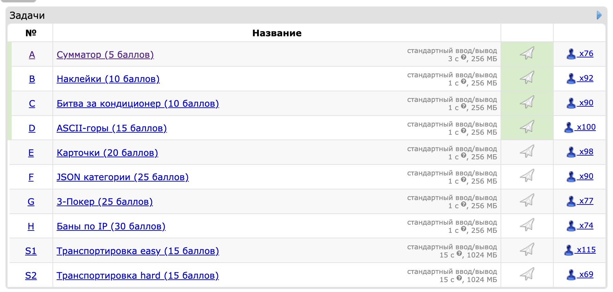

# Мой результат

### Напишите программу, которая выводит сумму двух целых чисел.

Так как это ознакомительная задача, то вы можете посмотреть и отправить авторские примеры решений (смотрите ссылку в сайдбаре в разделе «Материалы соревнования»). Конечно, в других задачах примеры решений не предоставляются.

Входные данные
В первой строке входных данных содержится целое число 𝑡
 (1≤𝑡≤104
) — количество наборов входных данных в тесте.

Далее следуют описания 𝑡
 наборов входных данных, один набор в строке.

В первой (и единственной) строке набора записаны два целых числа 𝑎
 и 𝑏
 (−1000≤𝑎,𝑏≤1000
).

Выходные данные
Для каждого набора входных данных выведите сумму двух заданных чисел, то есть 𝑎+𝑏
.

### Пример
### входные данные
5\
256 42\
1000 1000\
-1000 1000\
-1000 1000\
20 22\

### выходные данные
298\
2000\
0\
0\
42

### Для отслеживания посылок компания NOZO использует наклейки с надписями. Иногда надпись (или её часть) на наклейке нужно исправить, и тогда поверх старой наклейки лепят новую.

На очередной посылке появилось слишком много наклеек и теперь невозможно прочитать наклеенную надпись целиком.

Помогите это сделать по истории этих наклеек.

Входные данные
Первая строка 𝑠
 представляет собой содержимое изначальной наклейки. Гарантируется, что её длина не превышает 1000
 символов.

Во второй строке записано целое число 𝑛
 (1≤𝑛≤1000
), обозначающее количество наклеенных поверх наклеек.

Далее идёт 𝑛
 строк, каждая из которых описывает очередную наклейку в порядке её применения: от самой старой к самой новой. Каждое описание содержит два числа 𝑠𝑡𝑎𝑟𝑡𝑖
 и 𝑒𝑛𝑑𝑖
 (1≤𝑠𝑡𝑎𝑟𝑡≤𝑒𝑛𝑑≤|𝑠|
, где |𝑠|
 обозначает длину строки 𝑠
) и через пробел строку 𝑟𝑖
, которая была записана поверх символов между 𝑠𝑡𝑎𝑟𝑡𝑖
 и 𝑒𝑛𝑑𝑖
. Гарантируется, что длина строки 𝑟𝑖
 точно равна 𝑒𝑛𝑑−𝑠𝑡𝑎𝑟𝑡+1
. Эта запись обозначает, что поверх всех символов, начиная с символа под номером 𝑠𝑡𝑎𝑟𝑡
 и заканчивая символом под номером 𝑒𝑛𝑑
, была наклеена строка 𝑟𝑖
.

Гарантируется, что все строки состоят только из строчных латинских букв.

Выходные данные
Выведите итоговую строку, которая видна после применения всех наклеек.

### Примеры
### входные данные
somesuperlongstring\
3\
1 2 la\
4 4 d\
10 13 tiny\
### выходные данные
lamdsupertinystring
### входные данные
somesuperlongstring\
4\
1 2 la\
4 4 d\
10 13 tiny\
4 5 ed
### выходные данные
lamedupertinystring

### В офисе стоит кондиционер, на котором можно установить температуру от 15 до 30 градусов.

В офис по очереди приходят 𝑛
 сотрудников. 𝑖
-й из них желает температуру не больше или не меньше 𝑎𝑖.
После прихода каждого сотрудника определите, можно ли выставить температуру, которая удовлетворит всех в офисе.

Входные данные
Каждый тест состоит из нескольких наборов входных данных. Первая строка содержит целое число 𝑡
 (1≤𝑡≤103
) — количество наборов входных данных. Далее следует описание наборов входных данных.

Первая строка каждого набора содержит целое число 𝑛
 (1≤𝑛≤103
) — количество сотрудников.

𝑖
-я из следующих 𝑛
 строк каждого набора входных данных содержит требование к температуре от 𝑖
-го сотрудника: либо ≥𝑎𝑖
, либо ≤𝑎𝑖
 (15≤𝑎𝑖≤30
, 𝑎𝑖
 — целое число). Требование ≥𝑎𝑖
 означает, что 𝑖
-й сотрудник желает температуру не ниже 𝑎𝑖
; требование ≤𝑎𝑖
 означает, что 𝑖
-й сотрудник желает температуру не выше 𝑎𝑖
.

Гарантируется, что сумма 𝑛
 по всем наборам входных данных не превосходит 103
.

Выходные данные
Для каждого набора входных данных выведите 𝑛
 строк, 𝑖
-я из которых содержит температуру, удовлетворяющую всех сотрудников с номерами от 1
 до 𝑖
 включительно. Если такой температуры не существует, выведите −1
. После вывода ответа на очередной набор входных данных выводите пустую строку.

Если ответов несколько, выведите любой.

### Пример
### входные данные
4\
1\
>= 30\
6\
>= 18\
<= 23\
>= 20\
<= 27\
<= 21\
>= 28\
3\
<= 25\
>= 20\
>= 25\
3\
<= 15\
>= 30\
<= 24
### выходные данные
30

29\
19\
22\
21\
20\
-1

23\
22\
25

15\
-1\
-1